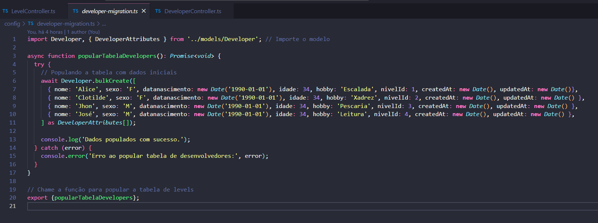
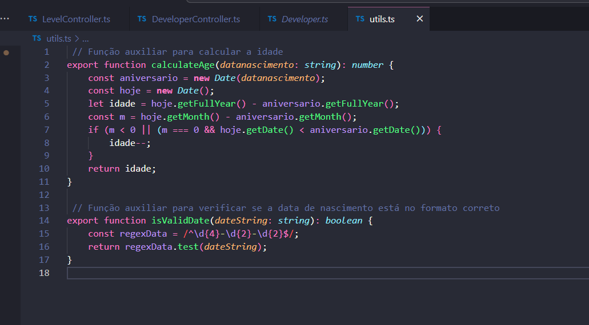
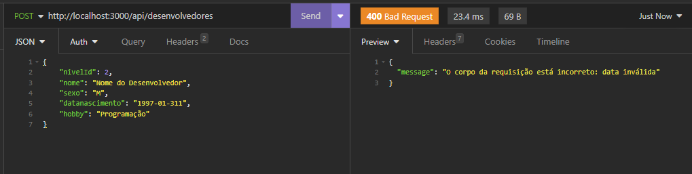
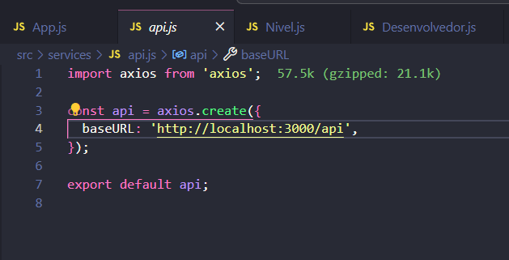
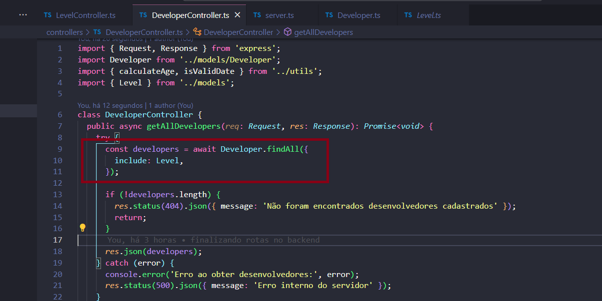
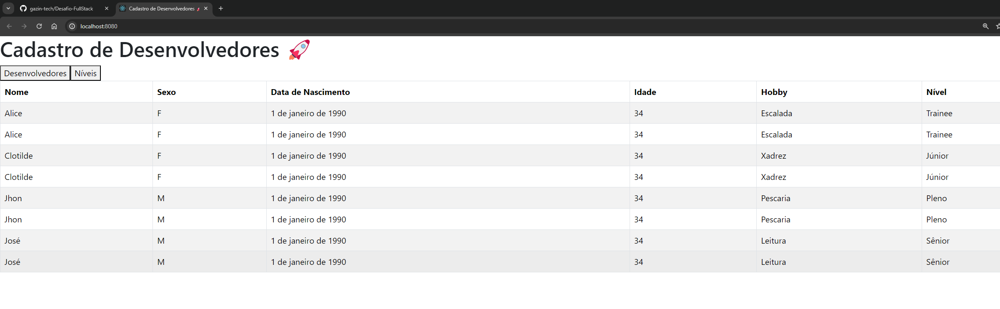
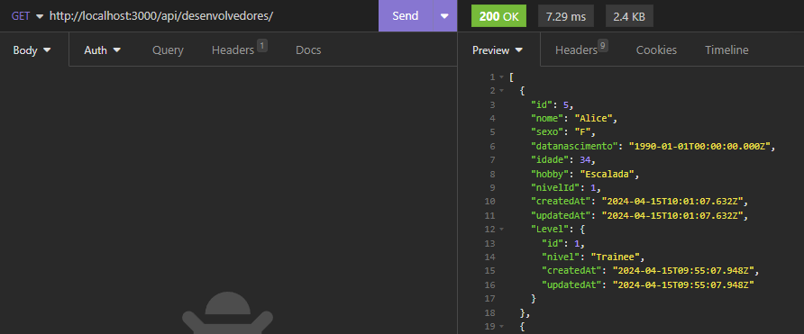

# cadastro-desenvolvedores-node-react
Criação de uma aplicação fullstack Node + React

# 1 - Estrutura Inicial do Projeto

Neste ponto do projeto, foi definida a estrutura inicial das pastas e arquivos que compõem a aplicação. Bem como configuração de variáveis do banco de dados no .env e a primeira versão do docker-compose.yml que vai ser gerado no futuro. A imagem a seguir ilustra essa estrutura:


# 2 - Configuração do Backend

Este capítulo detalha os passos para configurar o ambiente de backend do projeto utilizando Node.js e Express.

## Inicialização do Projeto Node.js
   ```bash
   cd backend
   npm init
   npm install express --save
   npm install sequelize sequelize-typescript pg @types/sequelize
   npm install express-validator
   npm install jest --save-dev
   npm install swagger-ui-express
  ```
## Configuração do TypeScript

O TypeScript é um superconjunto de JavaScript que adiciona tipagem estática e outros recursos úteis que podem melhorar a qualidade do código e a experiência de desenvolvimento. Abaixo estão os passos para adicionar o TypeScript ao seu projeto backend Node.js.

**TypeScript e Jest como uma dependência de desenvolvimento:**
   ```bash
   npm install --save-dev typescript
   npx tsc --init
   npm install --save-dev @types/express
   npm install --save-dev ts-node-dev
   npm install --save-dev jest ts-jest @types/jest
   npm install --save-dev jest supertest
   npm install cross-env --save-dev
   ```
Com isso, o nosso backend inicial está pronto para começar o desenvolvimento


Dando seguimento, nessa etapa foi criado os models para desenvolvedores e níveis, bem como as rotas para os mesmos:


Também foi necessário configurar corretamente o Dockerfile e docker-compose.yml para validar o funcionamento:


## Configuração dos controllers:

Nessa parte tive complicações com a migration do sequelize e decidi popular a tabela no docker, usando uma função em tempo de execução para poder testar o conteúdo do banco e também as respostas dos verbos http.



Para resolver problemas com a validação de data de nascimento e calcular a idade, foi criado um arquivo utils.ts na raiz do backend e importado no controller de desenvolvedores:





# 3 - Configuração do Frontend

Este capítulo detalha os passos para configurar o ambiente de frontend do projeto utilizando a biblioteca reactJS.

## Inicialização do Projeto React
   ```bash
   npx create-react-app frontend
   cd frontend
   npm install axios
   npm install bootstrap
   npm install react-bootstrap-icons
  ```

Nesse momento, foram removidos os arquivos padrões do react para deixar o projeto limpo. Aproveitando já será criado o service de api que conecta o frontend com o backend.


Tive um problema ao listar a tabela de desenvolvedores pois estava trazendo apenas o Id do nível. Para resolver, foi necessário um include no controller dos desenvolvedores:







